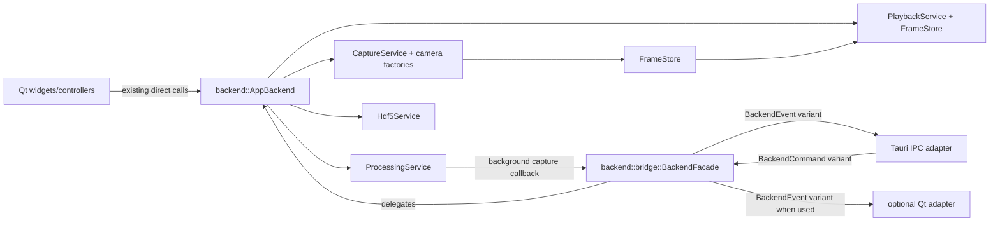

# Frontend-Neutral Backend Bridge

KIN-23 defines a backend adapter boundary that Qt and future Tauri/React code
can share without moving backend behavior into frontend bridge code.

## Public Entry Point

The stable C++ boundary is `backend::bridge::BackendFacade` in
`include/backend/app/BackendFacade.h`.

`BackendFacade` does not own services. It wraps one existing
`backend::AppBackend&`, keeps lifecycle explicit with `initialize()` and
`shutdown()`, and delegates commands to the same backend services the Qt
frontend already uses:

- camera commands delegate to `AppBackend`, `CaptureService`, and camera
  factories.
- recording commands delegate to `AppBackend::startFrameRecording()` and
  `AppBackend::stopFrameRecording()`.
- processing settings commands delegate to `ProcessingService`.
- recording load commands delegate to `Hdf5Service`.
- playback seek commands delegate to `PlaybackService` and `FrameStore`.

Bridge adapters must translate UI or IPC payloads into these command value
types. They must not reimplement capture, HDF5, processing, or playback logic.

## Command Types

`backend::bridge::BackendCommand` is a `std::variant` over frontend-neutral
commands:

- `CameraCommand`: configure mock camera, select hardware camera, apply camera
  script, reset selected hardware camera, start capture, and stop capture.
- `RecordingCommand`: start or stop direct frame recording.
- `ProcessingSettingsCommand`: apply processing config, ROI, realtime enable,
  drop-frame mode, realtime batch settings, realtime processing mode, and
  pixel-to-micron factor.
- `RecordingLoadCommand`: open an HDF5 recording or experiment file and read
  metadata through backend readers.
- `PlaybackSeekCommand`: resolve the latest or an absolute frame index through
  playback storage.

## Event Types

`backend::bridge::BackendEvent` is a `std::variant` over adapter-neutral events:

- `FrameReadyEvent`: frame metadata for playback or background-capture frames.
- `CameraStatusEvent`: configured/running state plus capture counters.
- `RecordingStatusEvent`: idle/starting/recording/stopped/loaded/error state
  plus frame counts.
- `ProcessingResultEvent`: processing throughput and object summary payload.
- `PlaybackPositionEvent`: current requested frame and retained frame range.
- `BackendErrorEvent`: source, command category, and error message.

Adapters install an event sink with `BackendFacade::setEventSink()`. Qt can keep
using direct service calls, while a Tauri bridge can map IPC calls to facade
commands and map facade events to Tauri events.

## Flow

## Adapter Rules

- Keep one backend service graph per process. Construct `AppBackend`, then wrap
  it in `BackendFacade` for bridge callers.
- Keep lifecycle explicit: call `initialize(dataDir)` before dispatching
  commands and `shutdown()` during adapter teardown.
- Treat command handlers as orchestration only. If a command needs behavior that
  does not exist in backend services, add it to the backend service first and
  delegate from the facade.
- Do not include `frontend/*` headers or Qt widget classes in bridge command or
  event payloads.
- Use `BackendFrame` or existing backend frame APIs for frame bytes. Use
  `FrameReadyEvent` to notify adapters that a frame can be fetched.
