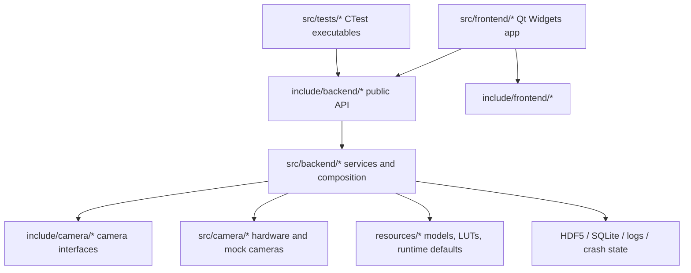

# Project Structure

This document describes the current repository layout and the intended module
boundaries for future work. It is a documentation baseline only; it does not
move source files or change runtime behavior.

## Top-Level Layout

| Path | Role |
| --- | --- |
| `CMakeLists.txt` | Current root build graph. It defines the backend library, frontend executable, tests, and packaging targets. |
| `CMakePresets.json` | Linux and Windows configure/build/test presets, including the Linux backend-only preset. |
| `src/backend/` | Backend implementations: composition root, services, diagnostics, playback storage, and backend utilities. |
| `include/backend/` | Public backend headers consumed by frontend code, tests, and other backend components. |
| `src/frontend/` | Qt Widgets implementation: main entry point, main window, tabs, dialogs, controllers, models, widgets, and UI helpers. |
| `include/frontend/` | Frontend headers. These are not part of the backend API. |
| `src/camera/` | Camera implementations for hardware and mock capture. |
| `include/camera/` | Camera interfaces and frame types used by backend capture services. |
| `src/tests/` | C++ test executables registered from the root CMake file. Current tests link `mib_backend`. |
| `tests/` | Python and fixture-oriented test material. |
| `resources/` | UI files, default config resources, icons, installers, models, and LUT inputs copied or read at runtime. |
| `scripts/` and `tools/` | Operational scripts and standalone post-processing tools. |
| `docs/` | User-facing and contributor-facing documentation. `docs/architecture/` is the canonical home for architecture docs. |
| `knowledge_map/` | Existing living knowledge base with detailed service, threading, frontend, and data-model notes. |
| `cmake/`, `conan/`, `deploy/` | Build support, package profiles, and deployment infrastructure. |

## Current Build Shape

The root CMake file currently owns all target definitions:

- `mib_backend` is a static library. It contains backend services, playback
  storage, diagnostics, backend utilities, and camera implementations.
- `mib_studio_qt` is the Qt Widgets application. It is only defined when
  `MIB_BUILD_BACKEND_ONLY` is `OFF`, and it links `mib_backend`.
- Backend C++ tests are separate executables under `src/tests/`; each links
  `mib_backend` and is registered with CTest when `BUILD_TESTING` is enabled.
- The Linux backend-only preset sets `MIB_BUILD_BACKEND_ONLY=ON` and
  `BUILD_TESTING=ON`, which gives a fast verification path for backend work
  without building the frontend application.

The future module split should preserve this direction even if target
definitions move out of the root file later:

## Major Subsystems

### Backend Composition

`backend::AppBackend` is the composition root. It constructs and owns the
backend services, `FrameStore`, and the Qt signal bridge used for background
capture notifications. Frontend code should enter backend functionality through
`AppBackend` service getters or other explicit public backend APIs.

Source:

- `include/backend/AppBackend.h`
- `src/backend/AppBackend.cpp`

### Backend Services

Service implementations live in `src/backend/services/` with public headers in
`include/backend/services/`. Current services cover:

- capture and camera lifecycle
- frame processing, realtime snapshots, experiment accumulation, and batch mask
  sources
- HDF5 persistence, SQLite state, playback, and frame recording
- autofocus, trigger output, syringe pump control, YOLO segmentation, logging,
  and crash reporting

Add a new service here when it owns hardware, persistence, processing,
background work, or a reusable application capability that should be callable
without a widget.

### Playback Data Model

`backend::playback::FrameStore` is the shared in-memory frame ring used by
capture, processing, playback, and UI display paths.

Source:

- `include/backend/playback/FrameStore.h`
- `src/backend/playback/FrameStore.cpp`

### Camera Layer

The camera layer exposes `camera::common::ICamera` and concrete hardware/mock
implementations. Backend capture code depends on this interface; frontend code
should not own camera devices directly.

Source:

- `include/camera/common/ICamera.h`
- `src/camera/common/EGrabberCamera.cpp`
- `src/camera/mock/MockCamera.cpp`

### Frontend Application

Frontend code owns Qt Widgets, UI resources, tabs, dialogs, controllers, models,
and display helpers. It may call backend public APIs, but backend code must not
include frontend headers or depend on frontend classes.

Important groups:

- `src/frontend/core/` and `include/frontend/core/`: `main.cpp` and
  `MainWindow`
- `src/frontend/tabs/`: Connect, Preview, Config, Monitoring, Review,
  Nanopositioner, SyringePump, and Overview workflows
- `src/frontend/dialogs/`: modal configuration and review dialogs
- `src/frontend/controllers/`: UI workflow controllers
- `src/frontend/models/`, `widgets/`, `utils/`, and `system/`: Qt models,
  helper widgets, UI utilities, startup helpers, config watching, and updater
  integration

### Resources

Runtime resources stay under `resources/`. UI `.ui` files belong in
`resources/ui/`; default Qt resources and app assets stay with the existing
resource grouping. Model and LUT assets should remain data inputs rather than
source code.

### Tests

C++ tests that exercise backend services or processing should live in
`src/tests/` and link `mib_backend`. Python tests and script-oriented fixtures
currently live under `tests/` and `scripts/`.

## Placement Rules For New Code

Use these rules until the build is split into smaller CMake modules:

- Put reusable backend capabilities in `src/backend/` with public headers in
  `include/backend/`.
- Put backend service APIs in `include/backend/services/` and implementations
  in `src/backend/services/`.
- Put camera-independent frame capture abstractions in `include/camera/common/`
  and concrete camera implementations under `src/camera/`.
- Put widgets, dialogs, UI models, UI controllers, and visual formatting under
  `src/frontend/` and `include/frontend/`.
- Put runtime assets under `resources/`; do not bake large model or fixture data
  into source files.
- Put backend tests in `src/tests/` and register them with CTest.
- Keep detailed operational runbooks under `docs/howto/`; keep architecture and
  boundaries under `docs/architecture/`.

## Dependency Direction

The desired dependency direction is:

1. Frontend depends on backend public APIs.
2. Tests depend on backend public APIs.
3. Backend depends on camera interfaces and non-UI infrastructure libraries.
4. Camera implementations depend on camera common interfaces and hardware SDKs
   or mock frame sources.
5. Backend and camera layers do not depend on frontend headers, widgets, tabs,
   dialogs, models, or controllers.

This keeps backend functionality buildable and testable through
`MIB_BUILD_BACKEND_ONLY=ON` and prevents UI workflows from becoming required for
processing, storage, hardware, or pipeline validation.
