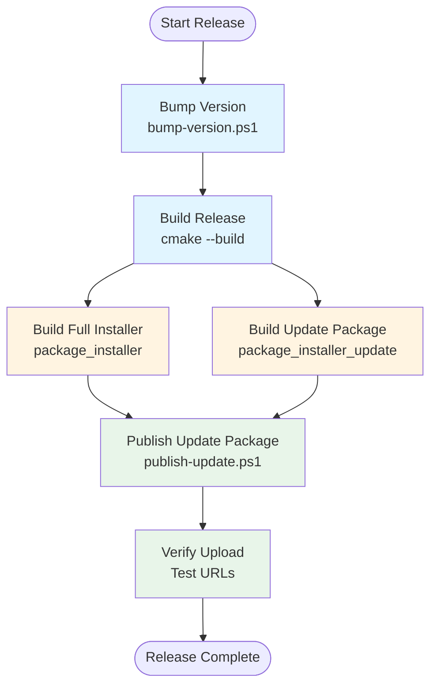

# Release Workflow

This guide documents the complete end-to-end process for releasing a new version of MIB Studio Qt, from version bumping through building installer packages and publishing updates.

## Overview

The release workflow consists of four main steps:

1. **Version Bump** - Increment the version number in `CMakeLists.txt` (and optionally create a git tag)
2. **Build Release** - Compile the application in Release configuration with all dependencies
3. **Build Installers** - Create both full installer and update package using InnoSetup
4. **Publish** - Upload packages to RustFS (S3-compatible) storage for distribution

## Prerequisites

Before starting a release, ensure you have:

1. **InnoSetup 6** - Required for building Windows installers
   - Download from [https://jrsoftware.org/isdl.php](https://jrsoftware.org/isdl.php)
   - Install to default location: `C:\Program Files (x86)\Inno Setup 6\`

2. **AWS CLI** - Required for publishing to RustFS
   - Install AWS CLI v2 from [https://aws.amazon.com/cli/](https://aws.amazon.com/cli/)
   - Configure credentials via:
     - Environment variables: `AWS_ACCESS_KEY_ID` and `AWS_SECRET_ACCESS_KEY`
     - AWS CLI profile: `aws configure --profile rustfs`
     - Or IAM role (if running on AWS infrastructure)

3. **Git** - For version tagging (optional but recommended)
   - Git must be available on PATH
   - Repository must be initialized

4. **Complete Development Environment**
   - CMake 3.21+
   - C++ compiler (MSVC on Windows)
   - Conan 2.x for dependency management
   - Qt6 development libraries

## Complete Workflow

### Step 1: Bump Version

Use the `bump-version.ps1` script to increment the version number in `CMakeLists.txt`. The script supports semantic versioning (X.Y.Z).

**Usage:**

```powershell
# Bump patch version (0.1.0 → 0.1.1) - bug fixes
.\bump-version.ps1 --patch

# Bump minor version (0.1.0 → 0.2.0) - new features
.\bump-version.ps1 --minor

# Bump major version (0.1.0 → 1.0.0) - breaking changes
.\bump-version.ps1 --major

# Bump and create git tag automatically
.\bump-version.ps1 --patch --tag
```

**What it does:**

- Reads current version from `CMakeLists.txt` (`DEFAULT_VERSION`)
- Calculates new version based on bump type
- Updates `CMakeLists.txt` with new version
- Optionally creates an annotated git tag (e.g., `v0.1.1`) if `--tag` is specified

**Example output:**

```
=== Version Bump Tool ===
Current version: 0.1.0
New version: 0.1.1 (patch bump)

Updating CMakeLists.txt...
CMakeLists.txt updated successfully

Creating git tag...
Git tag created: v0.1.1
Note: Push tags with: git push origin v0.1.1

=== Version Bump Complete ===
Version updated: 0.1.0 to 0.1.1
```

**Important Notes:**

- The version in `CMakeLists.txt` is used by CMake to set `PROJECT_VERSION`
- Installer filenames are automatically generated using this version: `MIB_Studio_Qt_Setup_v<version>.exe`
- If you create a git tag, remember to push it: `git push origin v<version>`
- CMake can also detect version from git tags (see `CMakeLists.txt` for details)

### Step 2: Build Release Configuration

Build the application in Release mode with all dependencies deployed:

```powershell
cmake --build build --config Release --target mib_studio_qt
```

**What this does:**

- Compiles the application in Release configuration
- Runs `windeployqt` to deploy Qt runtime DLLs and plugins
- Copies all required DLLs (OpenCV, HDF5, SQLite3, etc.) to `build/Release/`
- Copies Coremor DLL and other dependencies

**Verify the build:**

```powershell
# Check executable exists
Test-Path build\Release\mib_studio_qt.exe

# Check Qt plugins are deployed
Test-Path build\Release\platforms\qwindows.dll
Test-Path build\Release\imageformats\qjpeg.dll
```

**Troubleshooting:**

- If Qt DLLs are missing, ensure Conan packages are installed:
  ```powershell
  conan install . -of build --build=missing -s build_type=Release
  ```
- If `windeployqt` fails, check that Qt6 is properly installed via Conan

### Step 3: Build Installer Packages

Build both installer types using CMake targets:

```powershell
# Build full installer (includes eGrabber/VC++ redistributable)
cmake --build build --config Release --target package_installer

# Build update package (app files only, for auto-updates)
cmake --build build --config Release --target package_installer_update
```

**Installer Types:**

1. **Full Installer** (`MIB_Studio_Qt_Setup_v<version>.exe`)
   - Includes application files
   - Includes optional eGrabber SDK installer
   - Includes optional Visual C++ Redistributable
   - Larger size (~200+ MB)
   - For first-time manual installations

2. **Update Package** (`MIB_Studio_Qt_Update_v<version>.exe`)
   - Application files only
   - No eGrabber/VC++ redistributable
   - Smaller size (~100-150 MB)
   - For auto-updates (faster downloads)

**Output Location:**

Both installers are created in:
```
build\dist\MIB_Studio_Qt_Setup_v<version>.exe
build\dist\MIB_Studio_Qt_Update_v<version>.exe
```

**Version Injection:**

The version is automatically passed to InnoSetup via:
```
ISCC.exe /DAppVersion=<PROJECT_VERSION> mib-studio-qt.iss
```

The `PROJECT_VERSION` comes from `CMakeLists.txt` (either `DEFAULT_VERSION` or git tag detection).

**See Also:**

For detailed information about the installer build process, see [`build-installer.md`](build-installer.md).

### Step 4: Publish Packages

Use the `publish-update.ps1` script to upload packages to RustFS (S3-compatible storage) for distribution.

**Prerequisites:**

- AWS CLI installed and configured
- RustFS credentials configured (via profile or environment variables)
- Installer files built and available in `build\dist\`

**Publish Update Package (for auto-updates):**

```powershell
.\publish-update.ps1 `
  -Installer "build\dist\MIB_Studio_Qt_Update_v0.2.0.exe" `
  -Profile rustfs `
  -ReleaseNotesUrl "https://github.com/your-org/mib-studio-qt/releases/tag/v0.2.0"
```

**Publish Full Installer (optional, for manual downloads):**

```powershell
.\publish-update.ps1 `
  -Installer "build\dist\MIB_Studio_Qt_Setup_v0.2.0.exe" `
  -Profile rustfs
```

**What the script does:**

1. **Validates installer** - Checks file exists and has valid size
2. **Auto-detects version** - Extracts version from filename (e.g., `MIB_Studio_Qt_Update_v0.2.0.exe` → `0.2.0`)
3. **Computes SHA-256** - Generates hash for integrity verification
4. **Generates manifest** - Creates `latest.json` with:
   - Version number
   - Installer URL
   - SHA-256 hash
   - File size
   - Published timestamp
   - Optional release notes URL
5. **Uploads installer** - Uploads to `s3://<bucket>/<channel>/<installer-filename>` with `public-read` ACL
6. **Uploads manifest** - Uploads `latest.json` to `s3://<bucket>/<channel>/latest.json` with `public-read` ACL

**Script Parameters:**

- `-Installer` (required): Path to installer `.exe` file
- `-Version` (optional): Override version if auto-detection fails
- `-Profile` (optional): AWS CLI profile name (default: use environment variables)
- `-Endpoint` (optional, default: `https://s3.yofo.bio`): RustFS endpoint URL
- `-Bucket` (optional, default: `mib-studio-qt-updates`): S3 bucket name
- `-Channel` (optional, default: `stable`): Channel prefix (e.g., `stable`, `beta`)
- `-ReleaseNotesUrl` (optional): URL to release notes/changelog

**Example Output:**

```
=== Publishing MIB Studio Qt Update ===
Extracted version from filename: 0.2.0
Detected update package (app files only)

1. Computing SHA-256 hash...
   Hash: 0123456789abcdef0123456789abcdef0123456789abcdef0123456789abcdef
   Size: 123456789 bytes

2. Generating manifest...
   Manifest created: C:\Users\...\mib_studio_qt_latest_<guid>.json

3. Uploading installer...
   Installer uploaded successfully

4. Uploading manifest...
   Manifest uploaded successfully

=== Publish Complete ===
Manifest URL: https://s3.yofo.bio/mib-studio-qt-updates/stable/latest.json
Installer URL: https://s3.yofo.bio/mib-studio-qt-updates/stable/MIB_Studio_Qt_Update_v0.2.0.exe
```

**Important Notes:**

- The script automatically sets `public-read` ACL on uploaded files
- Version is auto-detected from filename pattern: `MIB_Studio_Qt_(Setup|Update)_v(\d+\.\d+\.\d+)\.exe`
- For auto-updates, always publish the **update package** first (smaller, faster downloads)
- The full installer can be published separately for manual first-time installations
- Ensure bucket policy allows public GET access (see [`auto-update-rustfs.md`](auto-update-rustfs.md))

**See Also:**

For detailed information about the publishing process and RustFS setup, see [`auto-update-rustfs.md`](auto-update-rustfs.md).

## Workflow Diagram



## Quick Reference

For experienced users, here's the condensed workflow:

```powershell
# 1. Bump version (patch example)
.\bump-version.ps1 --patch --tag

# 2. Push tag (if created)
git push origin v0.1.1

# 3. Build Release
cmake --build build --config Release --target mib_studio_qt

# 4. Build installers
cmake --build build --config Release --target package_installer
cmake --build build --config Release --target package_installer_update

# 5. Publish update package (for auto-updates)
.\publish-update.ps1 -Installer "build\dist\MIB_Studio_Qt_Update_v0.1.1.exe" -Profile rustfs

# 6. Publish full installer (optional)
.\publish-update.ps1 -Installer "build\dist\MIB_Studio_Qt_Setup_v0.1.1.exe" -Profile rustfs
```

## Verification Steps

After publishing, verify the release:

1. **Check manifest URL:**
   ```powershell
   Invoke-WebRequest -Uri "https://s3.yofo.bio/mib-studio-qt-updates/stable/latest.json" -Method Head
   ```
   Should return `200 OK`.

2. **Check installer URL:**
   ```powershell
   Invoke-WebRequest -Uri "https://s3.yofo.bio/mib-studio-qt-updates/stable/MIB_Studio_Qt_Update_v0.2.0.exe" -Method Head
   ```
   Should return `200 OK`.

3. **Test auto-update:**
   - Run the application
   - Check for updates (Help → Check for Updates)
   - Verify it detects the new version
   - Test download and installation

4. **Verify manifest content:**
   ```powershell
   $manifest = Invoke-WebRequest -Uri "https://s3.yofo.bio/mib-studio-qt-updates/stable/latest.json" | ConvertFrom-Json
   $manifest.version
   $manifest.installer_url
   $manifest.installer_sha256
   ```

## Troubleshooting

### Version Bump Issues

**Error: "Could not find DEFAULT_VERSION in CMakeLists.txt"**
- Ensure `CMakeLists.txt` contains: `set(DEFAULT_VERSION "X.Y.Z")`
- Check file encoding (should be UTF-8)

**Error: "Git tag already exists"**
- Tag was already created previously
- Either use existing tag or delete it: `git tag -d v0.1.1`

### Build Issues

**Error: "InnoSetup not found"**
- Install InnoSetup 6 to default location
- Or specify path: `cmake -DISCC_EXE="C:/Path/To/ISCC.exe"`

**Error: "Missing files in installer"**
- Verify Release build completed successfully
- Check that `windeployqt` ran (look for Qt DLLs in `build/Release/`)
- Ensure all dependencies are in `build/Release/`

### Publish Issues

**Error: "Installer file does not exist"**
- Verify installer was built successfully
- Check path is correct (relative to script location or use absolute path)

**Error: "Cannot extract version from filename"**
- Filename must match pattern: `MIB_Studio_Qt_(Setup|Update)_v<version>.exe`
- Or provide version explicitly: `-Version "0.2.0"`

**Error: "Installer upload failed" (403 Forbidden)**
- Check AWS credentials are configured correctly
- Verify bucket exists and you have write permissions
- Check endpoint URL is correct

**Error: "403 Forbidden" when accessing published files**
- Bucket policy may not allow public access
- Verify bucket policy allows public GET for `stable/*` objects
- See [`auto-update-rustfs.md`](auto-update-rustfs.md) for bucket policy setup

**Error: "Manifest upload failed"**
- Same as installer upload issues
- Check AWS credentials and permissions

## Related Documentation

- [`build-installer.md`](build-installer.md) - Detailed installer build process
- [`auto-update-rustfs.md`](auto-update-rustfs.md) - RustFS setup and publishing details
- [`../README.md`](../README.md) - Project overview and version management

## Best Practices

1. **Always test installers** before publishing (install on clean VM/system)
2. **Create git tags** for releases (use `--tag` flag with bump-version.ps1)
3. **Publish update package first** (for auto-updates), then full installer (optional)
4. **Verify public access** after publishing (test URLs without authentication)
5. **Document release notes** and provide URL via `-ReleaseNotesUrl` parameter
6. **Use semantic versioning** consistently (major.minor.patch)
7. **Test auto-update** after publishing to ensure end-to-end workflow works
