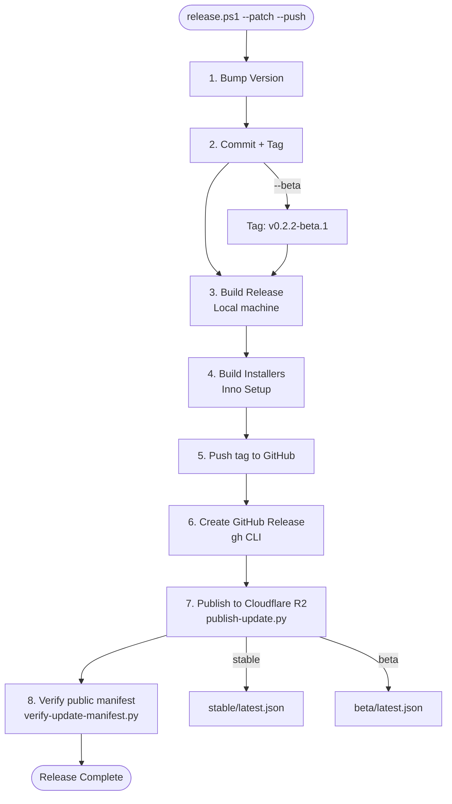

# Release Workflow

This guide documents the end-to-end process for releasing a new version of MIB Studio Qt, from version bumping through building installer packages and publishing updates.

## Overview

The release pipeline builds on a local Windows machine with the required proprietary dependencies, publishes installer assets to GitHub Releases with `gh`, and publishes the auto-update package to Cloudflare R2 through the Python command `publish-update.py`.
Calibration and lookup-table updates can be published independently with `publish-emodulus-lut.py`; see [`auto-update-r2.md`](auto-update-r2.md) for the LUT-specific object layout and rollback behavior.

### One-Command Release (`release.ps1`)

```powershell
# Production: bump, build, tag, push, create GitHub Release, publish to stable
.\release.ps1 --patch --push

# Beta: bump, build, tag as v0.2.2-beta.1, push, publish to beta channel
.\release.ps1 --patch --beta --push

# Preview what would happen
.\release.ps1 --patch --push --dry-run
```

### Release Channels

| Tag Format | Channel | GitHub Release | R2 Manifest | Auto-Update |
|---|---|---|---|---|
| `v1.2.3` | `stable` | Full release | `https://updates.yofo.bio/stable/latest.json` | All users |
| `v1.2.3-beta.1` | `beta` | Pre-release | `https://updates.yofo.bio/beta/latest.json` | Testers only |

### What `release.ps1 --push` Does

1. Bumps version in `cmake/MIBVersion.cmake`.
2. Commits the version bump.
3. Creates a git tag (`v0.2.2` or `v0.2.2-beta.1`).
4. Builds Release locally (`cmake --build`).
5. Builds both Inno Setup installers.
6. Pushes branch and tag to GitHub.
7. Creates a GitHub Release with installers and SHA-256 checksums.
8. Publishes the update package to Cloudflare R2 via `publish-update.py`.

### Crash reporting (Sentry) in the tagged release

The tag-triggered CI release (`.github/workflows/release.yml`) also wires up
Sentry so crashes from shipped builds are actually useful:

- **DSN injection** — the Configure step passes `-DMIB_SENTRY_DSN` from the
  `SENTRY_DSN` secret, so the installed app sends events (without it, releases
  run in local-only mode and nothing reaches Sentry).
- **Debug symbol upload** — after the build it runs
  `sentry-cli debug-files upload` on `build\Release` and creates/finalizes the
  `mib_studio_qt@<version>` release. Without uploaded PDBs, captured minidumps
  are unsymbolicated (= useless stacks). Gated on `SENTRY_AUTH_TOKEN` /
  `SENTRY_ORG` / `SENTRY_PROJECT` (skips cleanly if absent).

Required release secrets for symbolicated Sentry crashes: `SENTRY_DSN`,
`SENTRY_AUTH_TOKEN`, `SENTRY_ORG`, `SENTRY_PROJECT` (and `SENTRY_URL` for
self-hosted). `crashpad_handler.exe` must ship next to the app (the installer
copies it); verify it is present in the build output.

Options:

- `--patch|--minor|--major`: version bump type (required)
- `--beta`: create a beta/pre-release (`v0.2.2-beta.1`, channel `beta`)
- `--push`: push tag, create GitHub Release, and publish to R2
- `--skip-build`: skip build and publish; tag and push only
- `--dry-run`: show what would happen without making changes
- `--profile`: AWS/R2 profile for publishing; defaults to `MIB_STUDIO_R2_PROFILE`

## Prerequisites

Before starting a release, ensure you have:

1. Complete development environment:
   - CMake 3.21+, MSVC, Conan 2.x, Qt6
   - eGrabber SDK and Coremor DLLs
2. Inno Setup 6:
   - Default path: `C:\Program Files (x86)\Inno Setup 6\`
3. GitHub CLI:
   - Install from `https://cli.github.com/`
   - Authenticate with `gh auth login`
4. Cloudflare R2 publishing configuration:
   - Public custom domain: `https://updates.yofo.bio`
   - Dedicated bucket: `mib-studio-qt-updates`
   - Preferred for agent/Linux publishing: authenticated Wrangler session with R2 access.
   - S3 alternative: `MIB_STUDIO_R2_ENDPOINT="https://<account-id>.r2.cloudflarestorage.com"` plus `MIB_STUDIO_R2_PROFILE="mib-studio-r2"` or AWS credential environment variables.
   - GitHub Actions secrets:
     - `R2_ACCESS_KEY_ID`
     - `R2_SECRET_ACCESS_KEY`
     - `MIB_STUDIO_R2_ENDPOINT`
   - GitHub Actions publish step maps to AWS env vars:
     - `AWS_ACCESS_KEY_ID=${{ secrets.R2_ACCESS_KEY_ID }}`
     - `AWS_SECRET_ACCESS_KEY=${{ secrets.R2_SECRET_ACCESS_KEY }}`
     - `MIB_STUDIO_R2_ENDPOINT=${{ secrets.MIB_STUDIO_R2_ENDPOINT }}`
     - and invokes `publish-update.py --upload-method s3`
   - Optional proprietary dependency secrets:
     - `CONAN_REMOTE_URL`
     - `CONAN_REMOTE_USER`
     - `CONAN_REMOTE_PASSWORD`
   - Optional symbol upload secrets:
     - `SENTRY_DSN`
     - `SENTRY_AUTH_TOKEN`
     - `SENTRY_URL`
     - `SENTRY_ORG`
     - `SENTRY_PROJECT`
   - Do not commit R2 credentials or write tokens to the repo.
5. Python. Install `boto3` only when using the S3-compatible upload backend instead of Wrangler.

For R2 bucket, DNS, cache, migration, and rollback details, see [`auto-update-r2.md`](auto-update-r2.md).

## Complete Workflow

### Step 1: Bump Version

Use `bump-version.ps1` to increment `cmake/MIBVersion.cmake`.

```powershell
.\bump-version.ps1 --patch
.\bump-version.ps1 --minor
.\bump-version.ps1 --major
.\bump-version.ps1 --patch --tag
```

The script reads `DEFAULT_VERSION`, calculates the new semantic version, updates the CMake version file, and optionally creates an annotated git tag.

### Step 2: Build Release Configuration

```powershell
cmake --build build --config Release --target mib_studio_qt
```

Verify the build:

```powershell
Test-Path build\Release\mib_studio_qt.exe
Test-Path build\Release\platforms\qwindows.dll
Test-Path build\Release\imageformats\qjpeg.dll
```

### Step 3: Build Installer Packages

```powershell
cmake --build build --config Release --target package_installer
cmake --build build --config Release --target package_installer_update
```

Installer outputs:

```text
build\dist\MIB_Studio_Qt_Setup_v<version>.exe
build\dist\MIB_Studio_Qt_Update_v<version>.exe
```

Use the update package for auto-updates. The full setup installer is for first-time manual installs.

### Step 4: Publish Packages

Set R2 publishing configuration. By default, `publish-update.py` uses Wrangler when `MIB_STUDIO_R2_ENDPOINT` is not set. Set `MIB_STUDIO_R2_ENDPOINT` and `MIB_STUDIO_R2_PROFILE` only when publishing through S3-compatible credentials.

Publish the update package:

```bash
python publish-update.py \
  --installer "build/dist/MIB_Studio_Qt_Update_v0.2.0.exe" \
  --release-notes-url "https://github.com/gavinlouuu-kpt/mib-studio-qt/releases/tag/v0.2.0"
```

Publish the optional full installer:

```bash
python publish-update.py --installer "build/dist/MIB_Studio_Qt_Setup_v0.2.0.exe"
```

`publish-update.py`:

- Validates the installer exists and has nonzero size.
- Auto-detects the version from `MIB_Studio_Qt_(Setup|Update)_vX.Y.Z.exe`.
- Computes SHA-256 and file size.
- Generates `<channel>/latest.json`.
- Uploads the installer and manifest to `s3://mib-studio-qt-updates/<channel>/...`.
- Prints final public URLs under `https://updates.yofo.bio`.

Important parameters:

- `--endpoint`: R2 S3 API endpoint; defaults to `MIB_STUDIO_R2_ENDPOINT`
- `--bucket`: R2 bucket; defaults to `mib-studio-qt-updates`
- `--public-base-url`: public custom domain; defaults to `https://updates.yofo.bio`
- `--channel`: `stable` by default, `beta` for beta releases
- `--profile`: AWS/R2 profile; defaults to `MIB_STUDIO_R2_PROFILE`
- `--acl`: optional ACL for legacy S3-compatible targets; leave empty for R2
- `--release-notes-url`: optional GitHub release or changelog URL
- `--upload-method`: `auto` by default; uses S3 when `--endpoint`/`MIB_STUDIO_R2_ENDPOINT` is set, otherwise Wrangler

## Verification Steps

After publishing, verify public access from a network path that does not use private credentials:

```bash
python verify-update-manifest.py
```

For beta channel:

```bash
python verify-update-manifest.py --manifest-url "https://updates.yofo.bio/beta/latest.json"
```

Manual checks:

```powershell
Invoke-WebRequest -Uri "https://updates.yofo.bio/stable/latest.json" -Method Head
$manifest = Invoke-WebRequest -Uri "https://updates.yofo.bio/stable/latest.json" | ConvertFrom-Json
Invoke-WebRequest -Uri $manifest.installer_url -Method Head
```

App smoke checks:

- New builds should use `https://updates.yofo.bio/stable/latest.json` by default.
- Override still works for emergency reroutes:

```powershell
$env:MIB_STUDIO_UPDATE_MANIFEST_URL = "https://updates.yofo.bio/stable/latest.json"
```

Launch the app and use Help -> Check for Updates.

## One-Command Reference

```powershell
# Production release
$env:MIB_STUDIO_R2_ENDPOINT = "https://<account-id>.r2.cloudflarestorage.com"
$env:MIB_STUDIO_R2_PROFILE = "mib-studio-r2"
.\release.ps1 --patch --push

# Beta release
.\release.ps1 --patch --beta --push
```

## Step-by-Step Reference

```powershell
.\bump-version.ps1 --patch --tag
cmake --build build --config Release --target mib_studio_qt
ctest --test-dir build --build-config Release --output-on-failure
cmake --build build --config Release --target package_installer
cmake --build build --config Release --target package_installer_update
git push origin main
git push origin v0.2.2
gh release create v0.2.2 build\dist\MIB_Studio_Qt_Setup_v0.2.2.exe build\dist\MIB_Studio_Qt_Update_v0.2.2.exe
python publish-update.py --installer "build/dist/MIB_Studio_Qt_Update_v0.2.2.exe"
python verify-update-manifest.py
```

## Workflow Diagram



## Legacy Client Compatibility

Released builds compiled before this migration still request `https://s3.yofo.bio/mib-studio-qt-updates/stable/latest.json`. During migration, keep one compatibility path:

- Preferred: restore `s3.yofo.bio` as a redirect or compatibility endpoint that serves the migrated R2 manifest and artifacts.
- Acceptable cutoff plan: publish one final old-host manifest whose `installer_url` points to the R2 update package, then announce that clients must update before the old endpoint is retired.

Do not retire the old URL until release owners explicitly accept the cutoff plan.

## Rollback

If a bad R2 release is published:

1. Publish a corrected `stable/latest.json` that points at the last known-good update package.
2. Run `python verify-update-manifest.py`.
3. Purge Cloudflare cache for mutable manifest paths if stale content is observed.
4. Keep the old-host compatibility endpoint or redirect pointing at the corrected manifest until the fixed build is widely installed.

## Troubleshooting

**R2 upload fails**

- Confirm `MIB_STUDIO_R2_ENDPOINT` is set to the account-specific R2 S3 API endpoint.
- Confirm `MIB_STUDIO_R2_PROFILE` or AWS environment variables provide write access to the dedicated bucket.
- Confirm Python can import `boto3`.

**Manifest returns 403, 404, or stale content**

- Confirm `updates.yofo.bio` is attached to the intended R2 bucket.
- Confirm public read access is enabled through Cloudflare.
- Confirm mutable manifests have short TTL or cache bypass rules.

**Auto-update check fails**

- Run `python verify-update-manifest.py`.
- Confirm `installer_url` in the manifest points to `https://updates.yofo.bio/<channel>/MIB_Studio_Qt_Update_v<version>.exe`.
- Check app logs for HTTP status code and response body.
