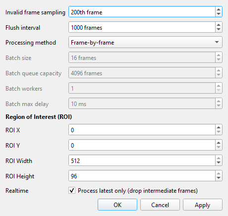
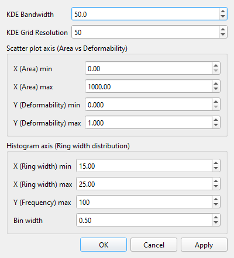
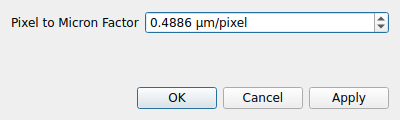

# Acquire & Record

The acquisition workflow: start the camera, frame the region of interest,
tune processing while watching the preview and monitoring charts, then
record an experiment to HDF5.

## Start the camera

Click **Start Live View** (main tab-bar corner). Frames start streaming from
the connected camera (or the mock folder) and the status-bar statistics
come alive. **Stop Camera** halts acquisition; statistics reset to zero.
Both buttons, and the Space bar over the preview, go through one guarded
command path: while an experiment is running or its data is being saved,
every way of stopping the camera is refused with the same message until the
experiment is stopped. A camera that fails to open or disconnects shows the
backend's reason in the status bar and offers **Start Live View** again.

## Overview tab — frame the ROI

- Shows the raw live stream (display rate capped independently of the
  camera rate, so a fast camera does not overload the UI).
- The semi-transparent **red rectangle** is the region of interest (ROI):
  drag it to reposition. The ROI feeds processing and recording directly,
  and the current geometry is echoed in the status bar
  (`ROI: w x h @ (x, y)`).
- Advanced: the tab hosts the camera-side GenICam script editor. **Apply to
  Camera** stops capture while the script is applied — restart the camera
  afterwards.

## Experiment ▸ Preview — tune processing

- The canvas shows the **processed** view. Overlay modes: **Off / Mask /
  Contours / Both**. While following live, cell colors mean
  **blue = target group, green = valid, red = invalid**.
- Playback controls under the canvas let you pause and scrub the recent
  frame buffer; **save buffer to disk** exports it as a single uncompressed
  AVI (ImageJ/Fiji-compatible) or a folder of TIFFs, never overwriting
  existing output.
- A **background** frame is captured automatically (or set manually from
  the playback panel); the current background shows in the sidebar preview.
- The **configuration inspector** below the image edits the processing
  configuration — thresholds, gates, multi-image, target group — and
  manages named profiles, including catalog-published ones. Its header
  shows the active **Profile**, its state (*Loaded*, *Edited (unsaved)*,
  *Saved*, *Conflict*), **Reset**, **Save**, and a **More…** menu with the
  profile-management actions (save as / rename / delete / duplicate,
  catalog updates and diff, choosing another config file, table view).
  Notices below the header explain unsaved edits, a file that changed
  elsewhere while you were editing (your edits are kept until you choose
  Reset or Save), a failed save, or an incompatible profile. The
  **Settings: Expanded / Compact / Hidden** bar at the bottom of the page
  sizes the inspector — *Compact* keeps only the profile/state header so
  the live image dominates during alignment — and the app remembers your
  choice and the divider position. Changes saved
  to the config file apply live; no restart needed. Note that several gates
  only take effect when their `enable_*` flag is on.

## Experiment ▸ Monitoring — watch the numbers

- Live histograms (area, deformability, brightness) and scatter plots
  (e.g. deformability vs. area) over the most recent frames, with
  scroll-to-zoom.
- Live totals: valid count, invalid count, algorithm FPS, valid FPS.
- Charts accumulate only while the tab is visible, and they are a live
  preview — they are not saved with the experiment.
- The top row also carries trigger bring-up controls (single and periodic
  test pulses) for commissioning a sorter.

## Settings dialogs

**Settings ▸ Processing Settings** — the full processing configuration
form: blur/threshold, validity gates, ring-ratio and target-group gating,
multi-image capture.

**Settings ▸ Monitoring Settings** — chart bin counts, axis ranges, and
refresh rate for the Monitoring page.

**Settings ▸ Pixel-to-Micron** — the pixel→micrometre conversion factor
(default 0.4886 µm/px) used for area and derived metrics.

## Record an experiment

1. Make sure the camera is running (**Start Live View**). Start runs a
   readiness check first: if anything blocks it — camera not running, a
   requested hardware camera that fell back to the simulated one, the
   pinned processing core not active, no free space at the destination, an
   unacknowledged save fault from the previous run — a dialog lists each
   blocked check with what to do about it. Warnings (no background image,
   simulated camera, Latest Frame delivery) do not block.
2. Click **Start Experiment** (Experiment tab-bar corner). A Save dialog
   asks where to write the HDF5 file (`.h5` is appended if you omit it).
   The app freezes the run's configuration (camera, ROI, processing core,
   configuration revision, background, calibration factor) into the file
   before the first frame; if the configuration changes between the check
   and the start, the start is refused and you simply start again.
   The corner indicator turns green and the flushed-frame counter starts.
3. Click **Stop Experiment** when done. The final flush runs in the
   background and the file is closed with its metadata (ROI, background,
   configuration) — wait for the indicator to return to grey before
   pulling a USB drive.

Recorded files contain the valid/invalid frame images, masks, per-frame
metrics, and the experiment metadata needed to reanalyse later — see
[Review & post-process](review-and-postprocess.md).

## Status bar statistics

| Field | Meaning |
|---|---|
| **Display** | Frames per second actually rendered in the preview |
| **Algo** | Realtime processing rate (frames/s) |
| **Valid / Invalid** | Classification rates per second |
| **Flushed(valid)** | Total valid frames written to HDF5 in the active experiment |
| **Camera** | Transport statistics from the camera (frame rate, MB/s) |
| **Ring width** | Median ring ratio of validated frames (drives autofocus) |

Rates reset to zero when an experiment starts or capture stops; totals
persist until the next experiment starts.
