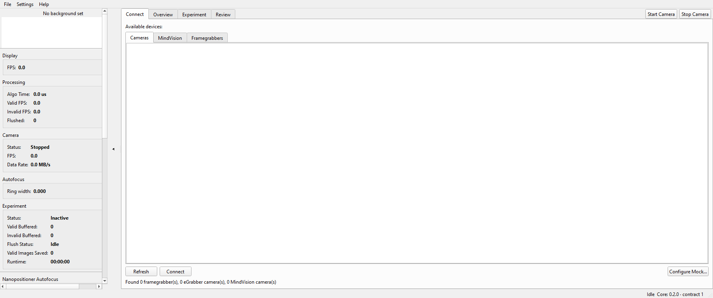
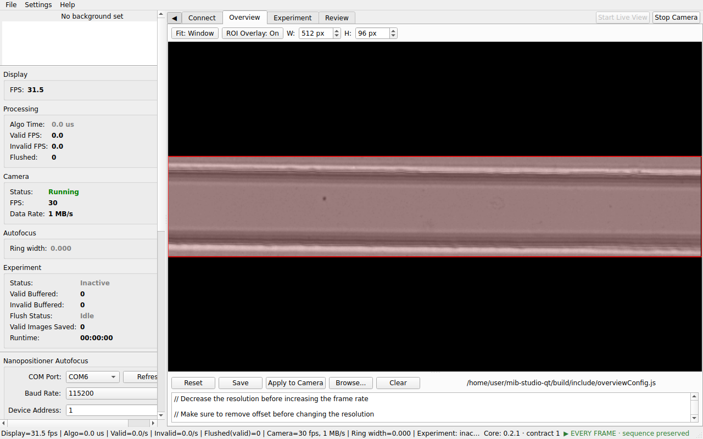
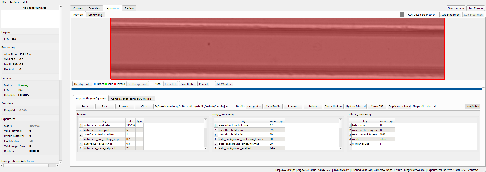
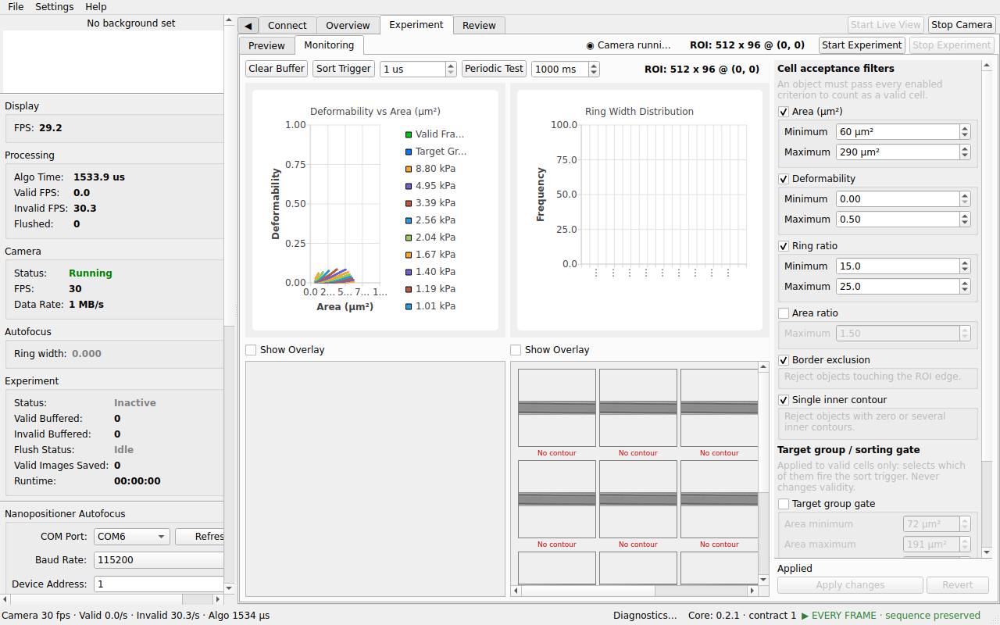
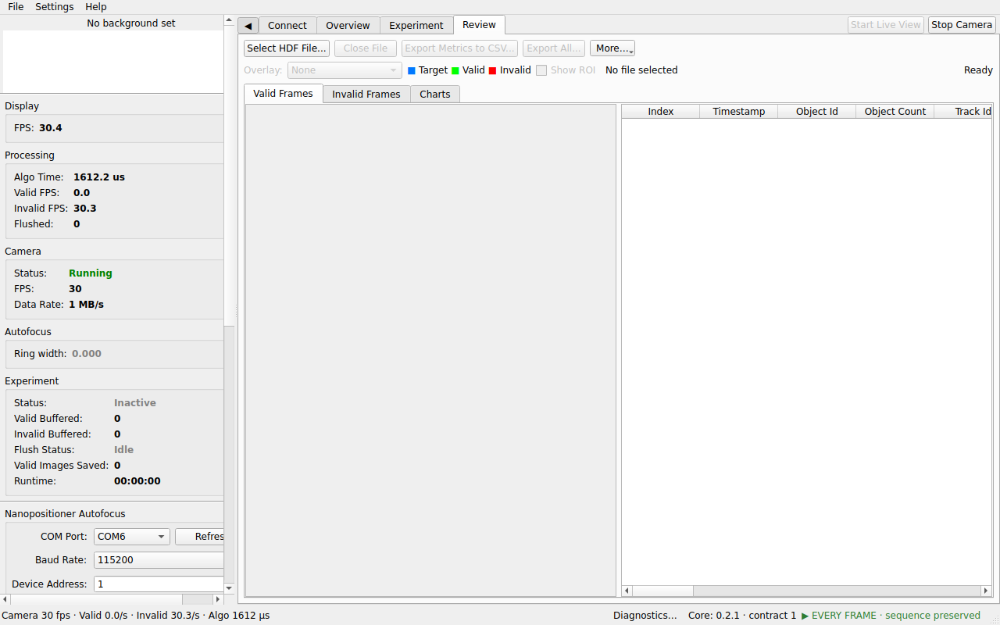

# MIB Studio Qt

MIB Studio Qt is a desktop application for real-time microscopy image
capture: it drives the camera, processes frames live, charts cell metrics
as they stream in, and records experiments to HDF5 files you can browse,
export, and reanalyse later.

This site is the operator guide. Skim the tour below to see the shape of
the app, then follow the workflow pages in order — or use the search box
whenever you are in doubt about a button, a setting, or an error.

## The workflow at a glance

### 1. Connect a camera

Every session starts on the **Connect** tab: pick a hardware camera,
a MindVision camera, or the folder-backed mock camera when no hardware is
attached. → [Connect a camera](connect.md)

### 2. Frame the live view

The **Overview** tab shows the raw live view. Draw the region of interest
here — everything downstream (processing, monitoring, recording) works on
that ROI. → [Acquire & record](acquire-and-record.md)

### 3. Tune the processing preview

**Experiment ▸ Preview** replays recent frames through the processing
pipeline so you can tune parameters and check masks before committing to
a recording. → [Acquire & record](acquire-and-record.md)

### 4. Record and monitor the experiment

**Experiment ▸ Monitoring** charts cell metrics in real time while
**Start/Stop Experiment** records the run to an HDF5 file.
→ [Acquire & record](acquire-and-record.md)

### 5. Review the results

The **Review** tab opens recorded HDF5 files: browse frames, export
metrics and images, or send a file back through the pipeline with new
parameters. → [Review & post-process](review-and-postprocess.md)

## When something goes wrong

Start at [Troubleshooting](troubleshooting.md) — where the logs live, how
crash reports work, and the usual fixes for cameras that will not start,
recordings that will not finalize, and updates that will not install.

## About the screenshots

Every screenshot on this site is **generated, not hand-captured**: the
`screenshot_tour` program launches the real application in mock-camera
mode and captures each documented view, and each release regenerates the
full set. The pictures therefore always match the released UI — if your
screen does not look like this guide for your version, that difference is
itself a debugging clue worth including in a bug report.
