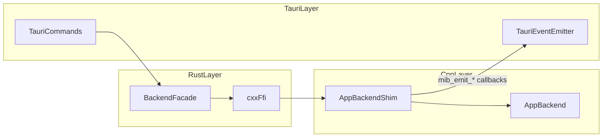

# Tauri Bridge

> Second desktop shell: Tauri (Rust + web UI) using the same C++ `mib_backend`
> as the Qt app through a `cxx` bridge.

**Source:** `src-tauri/src/main.rs`, `src-tauri/src/bridge/{mod.rs,ffi.rs,bridge.cpp}`, `src-tauri/build.rs`
**Related:** [[AppBackend]], [[Data-Flow]], [[../build-and-run/Build]], [[../build-and-run/Run-Modes]]

## Responsibility

- Provides a Tauri desktop entry point (`mib-studio.exe`) that reuses
  `backend::AppBackend` instead of duplicating capture/processing logic.
- Converts selected backend results to frontend-friendly payloads:
  - pull APIs via Tauri commands (`invoke`)
  - push APIs via events (`frame:new`, `stats:update`, `background:captured`)
- Keeps Tauri runtime independent of Qt DLL loading by linking a Qt-free
  `mib_backend` and filtering Qt Conan libs during Rust build.

## Runtime flow

## Current FFI surface (implemented)

Implemented in `ffi.rs` + `bridge.cpp` and consumed by `bridge/mod.rs`:

- Backend lifecycle:
  - `create_shim`
  - `backend_version`
- Camera:
  - discover cameras/framegrabbers
  - set hardware camera selection
  - configure mock camera
- Capture:
  - start, stop, running state
- Playback:
  - latest frame as PNG bytes
  - latest frame metadata
  - playback range
- Emitters:
  - install callbacks for frame stream, periodic stats, background capture

## Command coverage

`src-tauri/src/main.rs` registers many command modules. Current coverage:

- **Wired to backend bridge now**
  - `commands/camera.rs`
  - `commands/capture.rs`
  - `commands/playback.rs` (except `fetch_frame_by_index`)
- **Registered but still placeholder/stub**
  - `commands/processing.rs`
  - `commands/hdf5.rs`
  - autofocus / pump / trigger / config commands that still have TODO or
    `Not implemented` behavior

## Build and link model

1. Build C++ backend first (Release): `mib_backend.lib`.
2. Build Tauri Rust crate (`cargo build --release` in `src-tauri/`).
3. `src-tauri/build.rs`:
   - compiles `src/bridge/ffi.rs` + `src/bridge/bridge.cpp` with `cxx_build`
   - links `mib_backend.lib` and transitive Conan/vcpkg-resolved native libs
   - skips `qt6*` / `qt-*` Conan data files and panics if `Qt6` libs leak into
     link inputs

This keeps Tauri runtime free from Conan Qt DLL requirements while still
requiring other native dependencies (OpenCV, HDF5, Coremor, EGrabber-side DLLs
as applicable) to be deployable beside the executable or on `PATH`.

## Gotchas

- Rebuild `mib_backend` after changing capture callback/FFI signatures; stale
  symbols can break Rust linking.
- `fetch_frame_by_index` remains deferred until a dedicated bridge API is added.
- `src/bridge/bridge.cpp` at repo root is an older stub path; the active Tauri
  implementation is `src-tauri/src/bridge/bridge.cpp`.

## History notes

- [[../task/tauri-phase-b-vertical-slice]]
- [[../task/2026-04-20-mib-backend-decouple-qt]]
