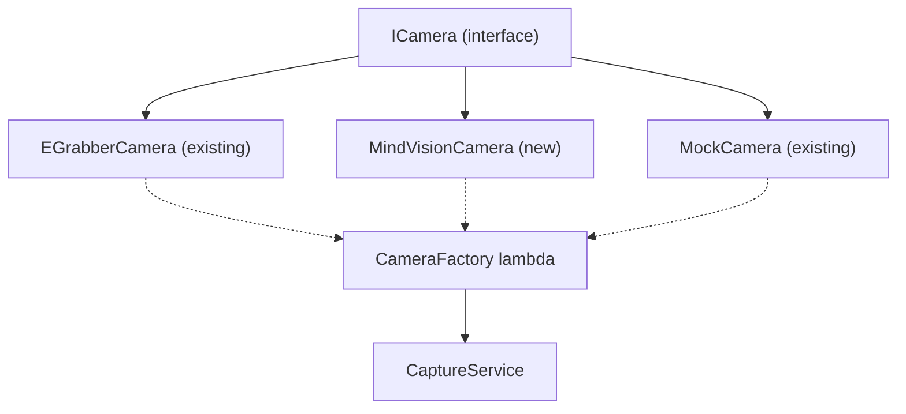

# Add MindVision Camera Implementation

## Architecture

The existing `ICamera` interface and `CameraFactory` pattern make this straightforward. We add a new `MindVisionCamera` class that implements `ICamera`, update discovery to find both camera types, and let the user choose which camera to connect to.

## Key Files Created/Modified

### Created
- `include/MindVision/` – SDK headers (CameraApi.h, CameraDefine.H, CameraStatus.h, CameraApiLoad.h)
- `include/camera/common/MindVisionCamera.h` – class declaration
- `src/camera/common/MindVisionCamera.cpp` – implementation (defines API_LOAD_MAIN for dynamic DLL loading)

### Modified
- `include/backend/services/CameraControlService.h` – added CameraType enum, cameraIndex field, discoverMindVisionCameras(), discoverAllCameras(), moved EGrabber.h include
- `src/backend/services/CameraControlService.cpp` – added discoverMindVisionCameras() and discoverAllCameras()
- `include/backend/AppBackend.h` – added setMindVisionCameraSelection(), selectedMvCameraIndex_
- `src/backend/AppBackend.cpp` – implemented setMindVisionCameraSelection(), updated isCameraConfigured()
- `src/frontend/tabs/ConnectTab.cpp` – DeviceSelection struct replaces DeviceIdx, populateDevices uses discoverAllCameras(), onConnect routes by type
- `src/frontend/system/DeviceInitManager.cpp` – discovery uses discoverAllCameras(), auto-connect handles MindVision
- `CMakeLists.txt` – added MindVisionCamera.cpp and include/MindVision include dir

## DLL Loading Notes

`CameraApiLoad.h` defines all MindVision function pointers as global `extern` variables, with `LoadSdkApi()` loading them from the installed `MVCAMSDK_X64.dll` via registry lookup. The `API_LOAD_MAIN` define (set only in `MindVisionCamera.cpp`) provides the actual variable definitions; all other TUs get extern declarations.
